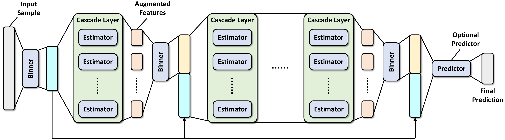

Model Architecture
==================

This page introduces the model architecture, training stage, and evaluating stage of DF21. You may find this page helpful on understanding the meanings of different parameters listed in `API Reference <../api_reference.html>`__.

Component
~~~~~~~~~

This section presents the meanings of key components in DF21, along with associated parameters.

* :class:`Binner`: The class used to reduce the number of splitting candidates for building decision trees.

  * :obj:`n_bins`, :obj:`bin_subsample`, :obj:`bin_type`

* :class:`Estimator`: Base estimators used in cascades layer of DF21. Default estimators are RandomForestClassifier and ExtraTreesClassifier.

  * :obj:`n_trees`, :obj:`max_depth`, :obj:`min_samples_split `, :obj:`min_samples_leaf`, :obj:`criterion`, :obj:`backend`

* :class:`Layer`: The cascade layer of DF21, which consists of multiple estimators.

  * :obj:`max_layers`, :obj:`n_estimators`

* :class:`Predictor`: The optional predictor concatenated to the DF21 model.

  * :obj:`use_predictor`, :obj:`predictor`, :obj:`predictor_kwargs`

Training
~~~~~~~~

The training stage of DF21 starts with discretizing feature-wise values of training samples into ``n_bins`` unique values, which is a commonly-used technique on accelerating building decision trees. After then, the first cascade layer in DF21 with ``n_estimators`` estimators is produced using the binned data (Notice that by default ``n_estimators`` would be multiplied by 2 internally). Furthermore, each estimator consists of ``n_trees`` decision trees that adopt the splitting criterion ``criterion``, satisfying the constraints enforced by ``max_depth`` and ``min_samples_leaf``.

After data binning and building the first cascade layer, DF21 enters the main training loop:

#. Bin the out-of-bag predictions of the previous cascade layer (denoted by augmented features in the figure above) using a newly-fitted :obj:`binner`;

#. Concatenate the augmented features to the binned training samples, serving as the new training data for the cascade layer to be built;

#. Build a new :obj:`layer` using the concatenated training data, following the same training protocols as that used to build the first cascade layer;

#. Get the out-of-bag predictions of the :obj:`layer` and estimate its generalization performance via out-of-bag estimation;

#. If the estimated performance is better than all previously-built layers, DF21 continues to build a new layer. Otherwise, the early-stopping procedure is triggered, and DF21 will terminate the training stage before reaching ``max_layers`` if the performance does not improve for ``n_tolerant_rounds`` rounds.

As an optional step, DF21 builds another predictor if ``use_predictor`` is set to ``True``. This predictor takes the input the concatenated training data from the last cascade layer, and outputs the predicted class probabilities for classification problems, and predicted values for regression problems. One can use predictors like random forest or GBDT through setting ``predictor``. Besides, you can better configure it through setting ``predictor_kwargs``.

Evaluating
~~~~~~~~~~

The evaluating stage follows the sequential structure of DF21. First, the testing samples are binned using the first :obj:`binner` and passed into the first :obj:`layer`. After then, DF21 sets the augmented features as the output of the current cascade layer, and bins it using the subsequent :obj:`binner`. After concatenating augmented features to the binned testing samples, DF21 moves to the next layer, util reaching the last cascade layer or the predictor.